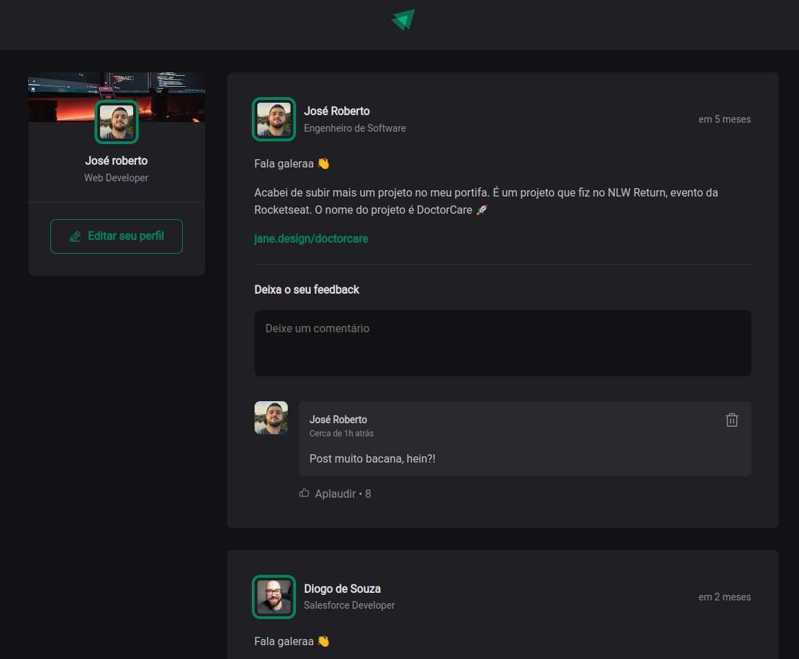
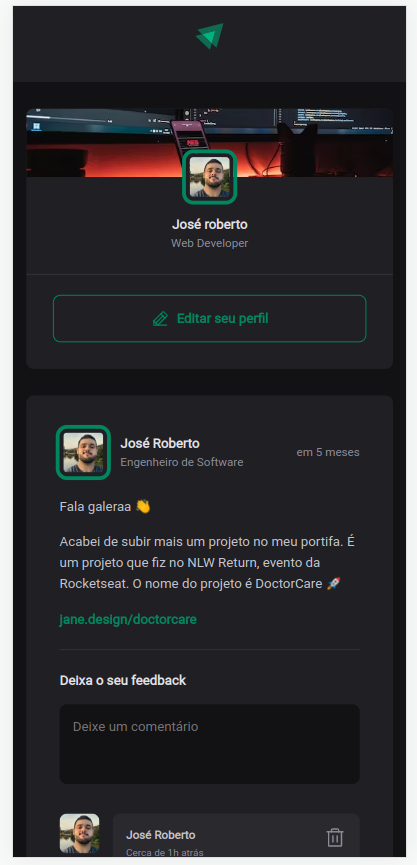

<!-- Improved compatibility of back to top link: See: https://github.com/othneildrew/Best-README-Template/pull/73 -->
<a name="readme-top"></a>
<!--
*** Thanks for checking out the Best-README-Template. If you have a suggestion
*** that would make this better, please fork the repo and create a pull request
*** or simply open an issue with the tag "enhancement".
*** Don't forget to give the project a star!
*** Thanks again! Now go create something AMAZING! :D
-->


<!-- PROJECT SHIELDS -->
<!--
*** I'm using markdown "reference style" links for readability.
*** Reference links are enclosed in brackets [ ] instead of parentheses ( ).
*** See the bottom of this document for the declaration of the reference variables
*** for contributors-url, forks-url, etc. This is an optional, concise syntax you may use.
*** https://www.markdownguide.org/basic-syntax/#reference-style-links
-->
[![Contributors][contributors-shield]][contributors-url]
[![Forks][forks-shield]][forks-url]
[![Stargazers][stars-shield]][stars-url]
[![Issues][issues-shield]][issues-url]
[![LinkedIn][linkedin-shield]][linkedin-url]
[![Contributors][contributors-shield]][contributors-url]

  <a href="https://github.com/Robetjunior/Ignite_Feed">
    
  </a>
  <a href="https://github.com/Robetjunior/Ignite_Feed">
    
  </a>

<h2 align="center">TODO LIST</h2>


<!-- ABOUT THE PROJECT -->
## Sobre o Projeto

TODO List, o projeto desenvolvido com a função de uma aplicação baseada feed de post onde o usário poderá publicar o feedback, aplaudi-los e podendo deletar.

Projeto feito em: HTML, CSS3, Typescript, ReactJS

<p align="right">(<a href="#readme-top">back to top</a>)</p>


<!-- GETTING STARTED -->
## Começando

Este é um exemplo de como você pode dar instruções sobre como configurar seu projeto localmente.
Para colocar uma cópia local em funcionamento, siga estas etapas de exemplo simples.

### Pré-requisitos

Este é um exemplo de como listar as coisas que você precisa para usar o software e como instalá-las.
* npm
  ```sh
  npm install npm@latest -g
  ```

### Instação

1. Clone o repositório
   ```sh
   git clone https://github.com/Robetjunior/Ignite_Feed.git
   ```
2. Instale pacotes NPM
   ```sh
   npm install
   ```
3. Inicie o projeto usando
   ```
   npm run dev
   ```

<p align="right">(<a href="#readme-top">back to top</a>)</p>


<!-- CONTRIBUTING -->
## Contribuindo

As contribuições são o que torna a comunidade de código aberto um lugar incrível para aprender, inspirar e criar. Quaisquer contribuições que você fizer são **muito apreciadas**.

Se você tiver uma sugestão para melhorar isso, bifurque o repositório e crie uma solicitação pull. Você também pode simplesmente abrir um problema com a tag "melhoria".
Não se esqueça de dar uma estrela ao projeto! Obrigado novamente!

1. Fork o Projeto
2. Crie a sua Feature Branch (`git checkout -b feature/AmazingFeature`)
3. Commit sua atualizações (`git commit -m 'Add some AmazingFeature'`)
4. Push para a  Branch (`git push origin feature/AmazingFeature`)
5. Abre a Pull Request

<p align="right">(<a href="#readme-top">back to top</a>)</p>


<!-- LICENSE -->
## License

Distributed under the MIT License. See `LICENSE.txt` for more information.

<p align="right">(<a href="#readme-top">back to top</a>)</p>


<!-- CONTACT -->
## Contato

Project Link: [https://github.com/Robetjunior/Ignite_Feed/](https://github.com/Robetjunior/Ignite_Feed/)

<p align="right">(<a href="#readme-top">back to top</a>)</p>


<!-- MARKDOWN LINKS & IMAGES -->
<!-- https://www.markdownguide.org/basic-syntax/#reference-style-links -->
[contributors-shield]: https://img.shields.io/github/contributors/Robetjunior/Ignite_Feed.svg?style=for-the-badge
[contributors-url]: https://github.com/Robetjunior/Ignite_Feed/graphs/contributors
[forks-shield]: https://img.shields.io/github/forks/Robetjunior/Ignite_Feed.svg?style=for-the-badge
[forks-url]: https://github.com/Robetjunior/Ignite_Feed/network/members
[stars-shield]: https://img.shields.io/github/stars/Robetjunior/Ignite_Feed.svg?style=for-the-badge
[stars-url]: https://github.com/Robetjunior/Ignite_Feed/stargazers
[issues-shield]: https://img.shields.io/github/issues/Robetjunior/Ignite_Feed.svg?style=for-the-badge
[issues-url]: https://github.com/Robetjunior/Ignite_Feed/issues
[license-shield]: https://img.shields.io/github/license/Robetjunior/Ignite_Feed.svg?style=for-the-badge
[license-url]: https://github.com/Robetjunior/Ignite_Feed/blob/master/LICENSE.txt
[linkedin-shield]: https://img.shields.io/badge/-LinkedIn-black.svg?style=for-the-badge&logo=linkedin&colorB=555
[linkedin-url]: https://linkedin.com/in/josé-roberto-dev/